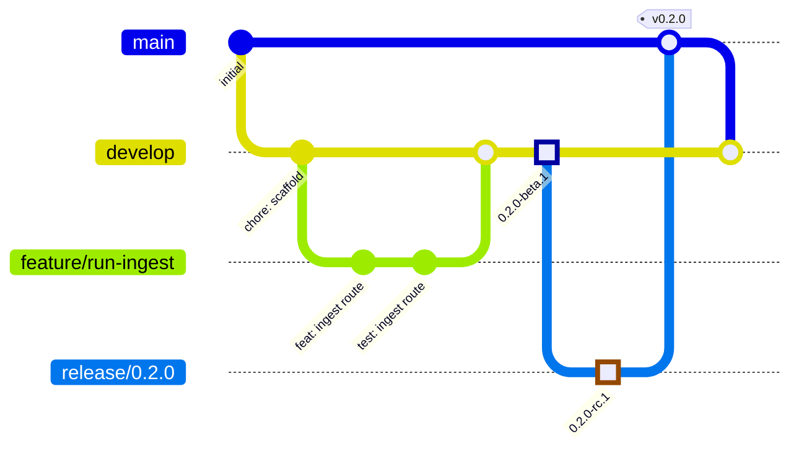
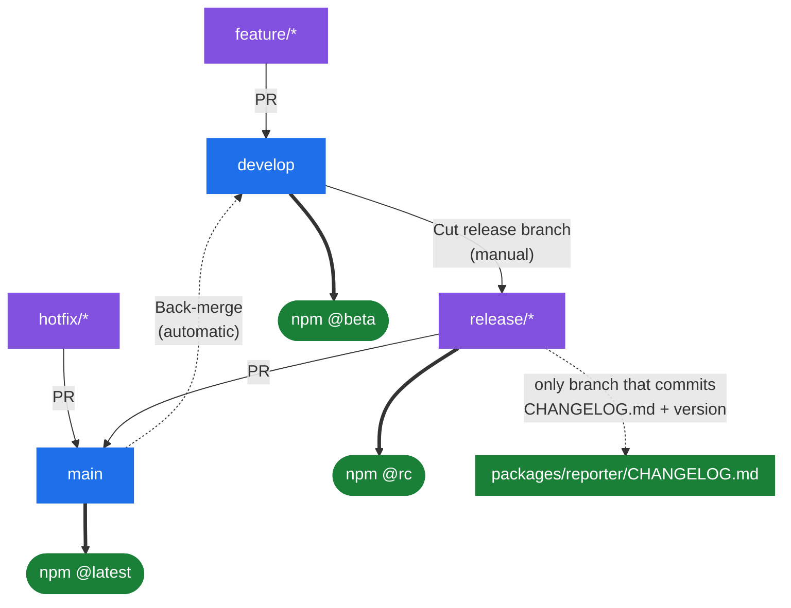

# Contributing to Eve Insights

Thanks for taking the time to contribute.

## Prerequisites

- **Node 24** — `nvm use` picks it up from `.nvmrc`
- **pnpm** — `corepack enable` is the easiest route

## Setup

```bash
pnpm install
```

That also installs the [lefthook](https://lefthook.dev) git hooks via the
`prepare` script, so formatting and commit linting run automatically.

## Working on a workspace

Every task runs from the repository root through Turborepo:

```bash
pnpm dev          # all apps
pnpm build
pnpm test
pnpm typecheck
pnpm lint
```

Scope to one workspace with `--filter`:

```bash
pnpm --filter @eve-insights/reporter test
pnpm --filter @eve-insights/platform dev
```

## Code style

[Biome](https://biomejs.dev) handles both formatting and linting. Configuration
lives in the root `biome.json`; the Next.js apps add a small nested config that
only enables the Next/React lint domains.

`pnpm lint:fix` applies safe fixes. The pre-commit hook does this automatically
for staged files and re-stages the result, so formatting should never be
something you think about.

## Testing

Each workspace has its own [Vitest](https://vitest.dev) config — `node`
environment for the library and the agent, `jsdom` for the Next apps.

```bash
pnpm test                                     # everything
pnpm --filter @eve-insights/reporter test:watch
```

New behaviour should come with tests.

## Commits

We use the **Angular conventional commit** format. This is not cosmetic:
`semantic-release` derives every version bump and changelog entry from these
messages.

```
type(scope): subject
```

**Types:** `feat`, `fix`, `docs`, `style`, `refactor`, `perf`, `test`, `build`,
`ci`, `chore`, `revert`

**Scopes:** `website`, `docs`, `platform`, `agent`, `reporter`, `repo`, `ci`, `deps`

```
feat(reporter): send run summaries to the ingest endpoint
fix(platform): reject payloads without a run id
docs(repo): document the release process
```

Not sure? Run `pnpm commit` for a guided prompt.

The `commit-msg` hook rejects invalid messages, and CI validates every commit on
a pull request — so `--no-verify` will not get a badly formatted commit merged.

### How commits become releases

| Commit | Release |
| --- | --- |
| `fix(...)` | patch |
| `feat(...)` | minor |
| any commit with `BREAKING CHANGE:` in the body | major |
| `docs`, `chore`, `test`, `ci`, ... | none |

Releases are fully automated. Pushing to `develop` publishes a `beta`
prerelease, `release/*` publishes an `rc`, and `main` publishes the stable
version and writes the changelog. Never bump versions or edit `CHANGELOG.md`
by hand.

Publishing is a job inside the CI workflow that depends on the aggregate `CI`
check, so a failing lint, typecheck, test or build stops the release rather
than racing it.

## Branching model

We use gitflow. A change travels from a `feature/*` branch, through `develop`
and a `release/*` branch, to `main` — and the result is merged back into
`develop`:



Two branches are permanent:

| Branch | Purpose | Publishes |
| --- | --- | --- |
| `main` | Production. Only ever receives merges from `release/*` or `hotfix/*`. | `latest` |
| `develop` | Integration branch. Day-to-day work lands here. | `beta` |

And three are short-lived:

| Branch | Cut from | Merges into | Publishes |
| --- | --- | --- | --- |
| `feature/*` | `develop` | `develop` | — |
| `release/*` | `develop` | `main` **and** `develop` | `rc` |
| `hotfix/*` | `main` | `main` **and** `develop` | — |

`main` and `develop` are both protected: no direct pushes, no force-pushes, no
deletion, and all changes arrive by pull request. `feature/*`, `release/*` and
`hotfix/*` are unprotected, which is what lets automation commit to them.

Every branch that publishes does so under its own npm dist-tag, so a prerelease
can never be installed by someone running `npm install @eve-insights/reporter`.

```bash
npm install @eve-insights/reporter        # stable, from main
npm install @eve-insights/reporter@beta   # from develop
npm install @eve-insights/reporter@rc     # from a release branch
```

### What each branch publishes



`main` is protected and nothing may push to it directly, which is why the
changelog and version commit are made on `release/*` and reach `main` through
the release PR.

### Day-to-day

```bash
git switch develop && git pull
git switch -c feature/run-ingest
# ... work, commit ...
git push -u origin feature/run-ingest
```

Open the PR against `develop`.

### Cutting a release

Releases are cut from the GitHub UI, not by hand — that way the version number
is derived from the commits rather than guessed.

**Actions → Cut release branch → Run workflow**, with `develop` selected.

| Input | Meaning |
| --- | --- |
| `version` | Leave blank to derive the next stable version from the commits on `develop`. Set it to override, e.g. `1.0.0`. |
| `dry_run` | Report the version that would be cut without creating anything. |

The workflow runs `semantic-release --dry-run` against `develop` as if it were a
stable release branch, so you get `0.2.0` rather than `0.2.0-beta.1`. It refuses
to run if there are no releasable commits, or if the branch already exists.

The equivalent by hand, if you ever need it:

```bash
git switch -c release/0.2.0 develop
git push -u origin release/0.2.0
```

Either way, pushing the branch publishes an `rc` prerelease. The release branch is also the **only**
place `CHANGELOG.md` and the version in `package.json` are committed — `main` is
protected and nothing can push to it directly, so those commits are made here and
reach `main` through the release PR.

When the branch is ready, PR it into `main`. That publishes the stable version.

The back-merge into `develop` is automatic — see below — so the changelog and
version commit are never lost.

> Because the commit happens on the prerelease branch, changelog headings are
> written against the `rc` version (`## 1.2.0-rc.1`) rather than the stable one.
> The GitHub Release created from `main` always carries the correct stable
> version and notes.

### Hotfixes

Branch from `main`, PR back into `main`. The back-merge into `develop` is
automatic.

### Back-merging

Anything that lands on `main` — a release, a hotfix — has to flow back into
`develop`, or the branches drift apart. The **Back-merge main to develop**
workflow does this on every push to `main`.

Both `main` and `develop` are protected and reject direct pushes, so the
back-merge always goes through a pull request from
`backmerge/main-to-develop-<sha>`:

- **Clean merge** — the PR is set to auto-merge and lands on its own once checks
  pass. Nothing for you to do.
- **Conflicts** — the PR stays open and is labelled as needing manual
  resolution. Until it is merged, `develop` is missing commits that are live on
  `main`, so treat it as urgent.
- **Already up to date** — no PR is opened.

You can also run it manually from the Actions tab.

## Pull requests

1. Branch off `develop` (or `main` for a hotfix).
2. Make sure `pnpm lint`, `pnpm typecheck`, `pnpm test`, and `pnpm build` pass.
3. Open the PR and describe the change and why it is needed.

## Code of Conduct

This project follows the [Contributor Covenant](./CODE_OF_CONDUCT.md).
